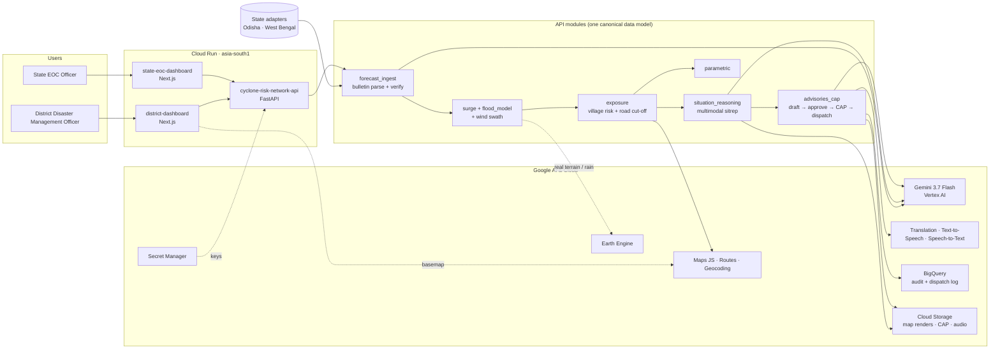

# TatRaksha: Cyclone Anticipatory Action & Early-Warning Platform

**TatRaksha turns an IMD cyclone bulletin into village-level action 72 hours before landfall.** Gemini 3.7 Flash
reads the bulletin and the hazard map, screening surge and rainfall-flood models rank every village, flood-aware
routing shows which shelters get cut off, and the District Disaster Management Officer approves CAP 1.2 advisories
in Odia, Bengali and English with voice, while the State EOC compares districts and sees parametric trigger estimates.

Build with AI (Google) hackathon, Track 5 · Full spec: [docs/PRD.md](docs/PRD.md) · Submission pack: [docs/SUBMISSION.md](docs/SUBMISSION.md) ·
Pitch deck: [docs/pitch/TatRaksha_Spontom_Pitch.pptx](docs/pitch/TatRaksha_Spontom_Pitch.pptx) ([PDF](docs/pitch/TatRaksha_Spontom_Pitch.pdf))

## Live URLs

| Service | URL |
|---|---|
| District dashboard (District Disaster Management Officer) | https://cyclone-risk-network-district-dashboard-847963771142.asia-south1.run.app |
| State EOC dashboard (State EOC Officer) | https://cyclone-risk-network-state-eoc-dashboard-847963771142.asia-south1.run.app |
| API (FastAPI, `/docs`, `/health`, `/api/status`) | https://cyclone-risk-network-api-847963771142.asia-south1.run.app |

> **Deployment status:** these are the Cloud Run URLs that `infrastructure/cloud-run/deploy.sh` creates (Cloud Run
> URLs are deterministic). The images were built and verified locally with Docker; the Cloud Run deploy itself
> still has to be run: see [Deploy](#deploy-to-cloud-run).

Demo deep link: `<district URL>/?replay=fani-2019&step=0&tab=forecast`
(`replay` = `fani-2019` | `amphan-2020`, `step` = 0..3 for T-72/48/24/6 h, `tab` = forecast | villages | assets | sitrep | advisories).

## Architecture



Every AI output is schema-validated JSON (`ai/schemas/`) from a versioned prompt (`ai/prompts/*_v1.md`) and stores
`model_name`, `model_version`, `prompt_version`. Numbers in the situation report are checked against the pipeline
output; the bulletin parse is cross-checked by a deterministic parser; every advisory needs the officer's approval.

## Google AI integration map

| Google technology | Role in TatRaksha | Status |
|---|---|---|
| **Gemini 3.7 Flash** (Vertex AI, `global`) | Bulletin → structured track; multimodal situation report from the hazard-map PNG + bulletin + exposure tables; English advisory drafting | **Live** (service account; `GEMINI_API_KEY` also supported) |
| **Google Maps Platform** | Maps JavaScript basemap; **Routes API** drive time village → shelter; **Geocoding** locality for advisories | **Live** |
| **Cloud Text-to-Speech** | Voice advisories (English, Bengali); Odia has no Cloud voice yet → labelled browser preview | **Live** |
| **Cloud Speech-to-Text** | Reads the generated advisory audio back so the officer can check it is intelligible | **Live** |
| **Cloud Translation** | Back-translation of Odia/Bengali advisories for the reviewer (life-safety text stays on approved templates) | **Live** |
| **BigQuery** | Append-only `audit_log` and `dispatch_log` tables (schemas in `infrastructure/bigquery/`) | **Live** |
| **Cloud Storage** | Archive of map renders sent to Gemini, CAP XML, advisory audio; cache of Gemini bulletin parses | **Live** |
| **Cloud Run + Secret Manager + Cloud Build + Artifact Registry** | Hosting of API and both dashboards; keys from Secret Manager | Scripted (`deploy.sh`) |
| **Earth Engine** | Copernicus DEM, JRC water, GPM IMERG rain, WorldPop, Open Buildings; surge inundation tiles | Code ready; demo until the project is registered |
| **Firebase / Firestore** | Record store | Code ready; demo (SQLite) until a Firestore database exists |
| **Vertex AI flood model** | Rainfall flood-likelihood model trained on Sentinel-1 extents | Roadmap (transparent heuristic today) |

## Real integrations vs demo mode

Every integration is real when configured and falls back to a **labelled demo mode** otherwise. At startup the
API probes each configured integration with one cheap live call, so the badge in both dashboards
("N integrations live · Demo mode · M fallbacks") shows what actually works, not just which env vars are set.
`GET /api/status` returns the same (`?probe=true` re-probes). `FORCE_DEMO_MODE=true` forces demo mode (tests use it).

| Integration | Env vars | Demo-mode fallback |
|---|---|---|
| Gemini | `GOOGLE_GENAI_USE_VERTEXAI=true` + `GOOGLE_CLOUD_PROJECT` + `GEMINI_LOCATION` (or `GEMINI_API_KEY`), `GEMINI_MODEL` | Deterministic regex parser; template sitrep/advisories built from the same data |
| Earth Engine | `EARTH_ENGINE_PROJECT` (registered) + service-account credentials | Committed synthetic grid + parametric rainfall in `data/replays/` |
| Maps Routes + Geocoding | `MAPS_API_KEY` | Network distance only |
| Maps basemap | `NEXT_PUBLIC_MAPS_API_KEY` (build time, referrer-restricted) | Leaflet + OpenStreetMap (also used if Google rejects the key) |
| Translation, Text-to-Speech, Speech-to-Text | `GOOGLE_CLOUD_API_KEY` | Approved templates; browser speech preview; no read-back |
| Cloud Storage | `GCS_BUCKET` + `GOOGLE_CLOUD_PROJECT` | Nothing archived |
| BigQuery | `GOOGLE_CLOUD_PROJECT` + `BIGQUERY_DATASET` | Local store only |
| Firestore | `FIREBASE_PROJECT_ID` (database must exist) | Local SQLite at `services/api/.data/` |
| SMS sandbox (Twilio test creds) | `SMS_SANDBOX_KEY=SID:TOKEN`, `SMS_SANDBOX_FROM`, `SMS_SANDBOX_TO` | Simulated, logged |
| Messaging sandbox (Telegram bot) | `MESSAGING_SANDBOX_TOKEN`, `MESSAGING_SANDBOX_CHAT_ID` | Simulated, logged |

Replay data (tracks, bulletins, villages, shelters, assets, roads) are always **sample data**, labelled in the data
(`metadata.is_sample`) and in the UI. Regenerate with
`cd services/api && uv run python ../../data/transformations/build_replays.py`.
Model assumptions: [geospatial/earth-engine/README.md](geospatial/earth-engine/README.md).

## Run locally

```bash
cp .env.example .env                      # keys optional: everything falls back to labelled demo mode
for a in apps/*; do cp $a/.env.example $a/.env.local; done
pnpm install
(cd services/api && uv sync)

pnpm dev:api                    # http://localhost:8050  (docs at /docs)
pnpm dev:district-dashboard     # http://localhost:3050  District Disaster Management Officer
pnpm dev:state-eoc-dashboard    # http://localhost:3051  State EOC Officer
pnpm test:api                   # pytest incl. a demo-mode end-to-end journey
pnpm build && pnpm lint
```

Run the production images locally (same as Cloud Run):

```bash
docker build -f services/api/Dockerfile -t tatraksha-api .
docker run --rm -p 8050:8080 -e FORCE_DEMO_MODE=true tatraksha-api
echo "NEXT_PUBLIC_API_URL=http://localhost:8050" > apps/district-dashboard/.env.production   # gitignored
docker build -f infrastructure/cloud-run/Dockerfile.web --build-arg APP=district-dashboard -t tatraksha-district .
docker run --rm -p 3050:8080 tatraksha-district
```

### Environment variables

| Variable | Where | Purpose |
|---|---|---|
| `GOOGLE_CLOUD_PROJECT`, `GOOGLE_CLOUD_LOCATION` | API | Project and region (`asia-south1`) |
| `GOOGLE_APPLICATION_CREDENTIALS` | API (local only) | Service-account JSON; Cloud Run uses its service account |
| `GOOGLE_GENAI_USE_VERTEXAI`, `GEMINI_LOCATION`, `GEMINI_MODEL`, `GEMINI_API_KEY` | API | Gemini via Vertex AI (`global`) or via API key |
| `MAPS_API_KEY` | API (secret) | Routes + Geocoding |
| `GOOGLE_CLOUD_API_KEY` | API (secret) | Translation, Text-to-Speech, Speech-to-Text |
| `GCS_BUCKET`, `BIGQUERY_DATASET` | API | Media archive bucket; dataset for `audit_log` / `dispatch_log` |
| `EARTH_ENGINE_PROJECT`, `FIREBASE_PROJECT_ID` | API | Opt-in once Earth Engine registration / Firestore exist |
| `SMS_SANDBOX_*`, `MESSAGING_SANDBOX_*` | API | Sandbox dispatch (optional) |
| `CORS_ORIGINS` | API | Allowed dashboard origins |
| `FORCE_DEMO_MODE` | API | Force every integration into demo mode |
| `NEXT_PUBLIC_API_URL` | Dashboards (build time) | API base URL |
| `NEXT_PUBLIC_MAPS_API_KEY` | Dashboards (build time) | Browser Maps key, restricted to `localhost` and `https://*.run.app` |

## Deploy to Cloud Run

```bash
export PATH=/opt/homebrew/share/google-cloud-sdk/bin:$PATH   # if gcloud is not on PATH
infrastructure/cloud-run/deploy.sh                 # api + district-dashboard + state-eoc-dashboard
infrastructure/cloud-run/deploy.sh api             # one service
```

The script builds each image with Cloud Build from the repo root, pushes it to Artifact Registry and deploys it with
the `hackathon-dev` service account, `--allow-unauthenticated`, region `asia-south1`. The API gets
`MAPS_API_KEY` and `GOOGLE_CLOUD_API_KEY` from Secret Manager (`maps-api-key`, `google-api-key`) and CORS for both
dashboard URLs. The browser Maps key is baked into the JS bundle through a generated, gitignored
`apps/<app>/.env.production` (uploaded via `.gcloudignore`, deleted afterwards), so it never enters git.

**Adding a Gemini API key later:** `printf %s "$KEY" | gcloud secrets create gemini-api-key --data-file=-`, then
rerun `deploy.sh api`: the script attaches `GEMINI_API_KEY=gemini-api-key:latest` whenever that secret exists.
Gemini already runs through Vertex AI with the service account; set `USE_VERTEX_GEMINI=false` to use the key instead.
Earth Engine / Firestore: `EARTH_ENGINE_PROJECT=<project> FIREBASE_PROJECT_ID=<project> deploy.sh api` once registered/created.

## 5-minute demo (PRD §44)

The timed, scene-by-scene script is in [docs/SUBMISSION.md](docs/SUBMISSION.md). Short version:
Fani 2019 at T-72h (Gemini-parsed bulletin, cone, verify track) → slide to T-24h (surge, rain-flood, wind swath) →
Village risk + Google Routes drive time + shelters cut off → Gemini sitrep from the hazard map → Odia advisory with
back-translation → approve → CAP 1.2 → sandbox dispatch → Bengali (Amphan) voice advisory with Speech-to-Text read-back →
State EOC: district comparison, parametric triggers, predicted vs observed flooding, audit trail.

## State onboarding: how a new state joins

A state joins by **configuration, not code** (PRD §40):

1. Write `data/adapters/<state>.json`: districts, languages, issuing authority, CAP sender, alert gateway, risk
   weights and a `village_field_map` that renames the state's own column names to the canonical village schema.
2. Drop the state's village, shelter, asset and road files into `data/replays/<replay>/` (or point the adapter at
   the state's feed); `data/schemas/canonical_v1.schema.json` validates them.
3. Add approved advisory templates for its languages to `services/api/app/advisories_cap/templates.py` (Telugu,
   Tamil and cross-border Bangla/Burmese are the next ones; Translation and TTS already cover most of them).
4. Everything downstream (surge, flood, exposure, Village Risk, Gemini sitrep, CAP, dispatch, parametric, State EOC)
   runs unchanged on the canonical model. Odisha (Fani 2019) and West Bengal (Amphan 2020) are built this way;
   the same path extends to Andhra Pradesh, Tamil Nadu and to Bangladesh / Myanmar on the shared Bay of Bengal.

## Known gaps

- Earth Engine: code paths are ready but the project is not yet registered, so terrain/rain use the committed synthetic grid.
- Rainfall flood likelihood is a transparent heuristic; the Vertex AI model trained on Sentinel-1 extents is not built.
- Surge is a screening bathtub model (labelled); defer to official IMD/INCOIS guidance.
- Odia/Bengali advisories use sample template translations that need native-speaker review. Cloud TTS has no Odia voice.
- SMS / messaging / voice-call dispatch are simulated until sandbox credentials are provided; Firestore is not created yet
  (records are per-instance SQLite, so the API runs as a single Cloud Run instance).
- Andhra Pradesh (rainfall-flooding) replay and live-forecast mode are not built.

## Layout

| Path | Purpose |
|---|---|
| `apps/district-dashboard/` | District Disaster Management Officer app |
| `apps/state-eoc-dashboard/` | State EOC Officer dashboard |
| `services/api/` | FastAPI gateway (all domain logic starts here as modules) |
| `services/forecast-ingest/` | IMD bulletin + weather ingestion, Gemini bulletin parsing |
| `services/surge/` | Storm surge estimation (Earth Engine) |
| `services/flood-model/` | Rainfall flood-likelihood model (Vertex AI) |
| `services/exposure/` | Exposure, Village Risk, road/shelter cut-off |
| `services/situation-reasoning/` | Gemini 3.7 Flash multimodal situation reports |
| `services/advisories-cap/` | Advisory drafting, approval, CAP XML, sandbox dispatch |
| `services/parametric/` | Parametric insurance trigger calculations (sample policies) |
| `services/localization/` | Speech-to-Text, Text-to-Speech, Translation |
| `ai/` | Versioned prompts (`prompts/*_v1.md`), JSON schemas exported from Pydantic (`uv run python -m app.ai.export_schemas`) |
| `data/` | Canonical schema (`schemas/`), state adapters (`adapters/`), replay datasets (`replays/`), generator (`transformations/`) |
| `geospatial/earth-engine/` | Earth Engine scripts + model assumptions |
| `infrastructure/` | Cloud Run, BigQuery, Firebase config |
| `docs/` | PRD and architecture notes |
